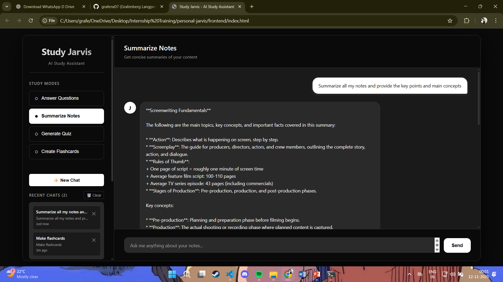

# Study Jarvis 🤖

An AI-powered study assistant that uses self-hosted LLMs (LLaMA 3/Mistral via Ollama) and vector databases (Pinecone) to help you learn from your notes effectively.

## 📸 Screenshots


*Auto-generate summaries, quizzes, and flashcards with one click. Track your chat history and manage documents easily.*

## 🌟 Features

- **📚 Note Management**: Upload PDF, DOCX, or TXT files
- **💬 Intelligent Q&A**: Ask questions and get answers from your notes
- **📝 Summarization**: Generate concise summaries of topics
- **📋 Quiz Generation**: Create practice quizzes automatically
- **🎴 Flashcards**: Generate study flashcards
- **🔍 Semantic Search**: Find relevant information using vector embeddings
- **🏠 Self-Hosted**: Complete privacy with local LLM
- **💾 Chat History**: Save and restore previous conversations
- **⚡ One-Click Generation**: Auto-generate content when switching study modes

## 🏗️ Architecture

```
User Interface (HTML/JS)
        ↓
FastAPI Backend
        ↓
    ┌───┴───┐
Pinecone    Ollama
(Vectors)   (LLaMA 3)
```

## 📋 Prerequisites

- **Python 3.10+**
- **Ollama** ([Download here](https://ollama.com/download))
- **Pinecone Account** ([Sign up free](https://www.pinecone.io/))
- **VS Code** (recommended)

## 🚀 Quick Start (40-Minute Setup)

### Step 1: Clone and Setup (5 min)

```powershell
# Navigate to project
cd "personal-jarvis\backend"

# Create virtual environment
python -m venv venv

# Activate virtual environment
.\venv\Scripts\Activate.ps1

# Install dependencies
pip install -r requirements.txt
```

### Step 2: Configure Environment (5 min)

```powershell
# Copy environment template
copy .env.example .env

# Edit .env with your settings
notepad .env
```

**Required settings:**
- `PINECONE_API_KEY`: Get from [Pinecone Console](https://app.pinecone.io/)
- `PINECONE_REGION`: Your Pinecone index region (e.g., us-east-1)

### Step 3: Setup Ollama (5 min)

```powershell
# Pull LLaMA 3 model (or mistral)
ollama pull llama3

# Start Ollama server (if not already running)
ollama serve
```

### Step 4: Initialize Database (2 min)

```powershell
# Test Pinecone connection
python pinecone_client.py

# Test Ollama connection
python llm_client.py
```

### Step 5: Start Backend (1 min)

```powershell
# Start FastAPI server
uvicorn app:app --reload
```

Backend will be running at: `http://localhost:8000`

### Step 6: Open Frontend (1 min)

1. Open `frontend/index.html` in your browser
2. Or use VS Code Live Server extension

### Step 7: Upload Notes (5 min)

```powershell
# Using the ingestion script
python ingest_notes.py "path\to\your\notes.pdf" "Subject Name" "Chapter 1"

# Or upload via the web interface
```

### Step 8: Start Learning! (16 min)

Try these example queries:
- "Explain the difference between merge sort and quick sort"
- "Summarize Chapter 3"
- "Generate 5 quiz questions on databases"
- "Create 10 flashcards for operating systems"

## 📁 Project Structure

```
personal-jarvis/
├── backend/
│   ├── app.py                 # FastAPI main application
│   ├── ingest_notes.py        # Note ingestion script
│   ├── pinecone_client.py     # Vector database client
│   ├── llm_client.py          # LLM communication
│   ├── requirements.txt       # Python dependencies
│   ├── .env.example           # Environment template
│   └── .env                   # Your configuration (create this)
├── frontend/
│   └── index.html             # Chat interface
└── README.md
```

## 🔧 API Endpoints

### Health Check
```http
GET http://localhost:8000/
```

### Check Status
```http
GET http://localhost:8000/status
```

### Upload Notes
```http
POST http://localhost:8000/upload
Content-Type: multipart/form-data

file: <your-file.pdf>
subject: "Computer Science"
chapter: "Chapter 1"
```

### Chat
```http
POST http://localhost:8000/chat
Content-Type: application/json

{
  "message": "Explain recursion",
  "mode": "answer",
  "top_k": 5
}
```

Modes: `answer`, `summarize`, `quiz`, `flashcard`

### Generate Quiz
```http
POST http://localhost:8000/quiz
Content-Type: application/x-www-form-urlencoded

topic=Data Structures&num_questions=5&subject=Computer Science
```

## 💡 Usage Examples

### Ingest Notes via CLI

```powershell
# Single file
python ingest_notes.py notes.pdf "Operating Systems" "Process Management"

# Entire directory
python ingest_notes.py "C:\Study\Notes" "Database Systems"
```

### Using the Web Interface

1. **Upload Notes**: Click "📤 Upload File" in sidebar
2. **Select Mode**: Choose from Answer, Summarize, Quiz, or Flashcard
3. **Ask Questions**: Type your question and press Enter
4. **View Sources**: See which notes were used to answer

### Example Questions

**Understanding:**
- "What is the difference between TCP and UDP?"
- "Explain polymorphism with examples"

**Summarization:**
- "Summarize Unit 4 on Operating Systems"
- "Give me key points from Chapter 2"

**Quiz Generation:**
- "5 multiple choice questions on databases"
- "10 questions about networking concepts"

**Flashcards:**
- "Create 15 flashcards for data structures"
- "Make flashcards for sorting algorithms"

## 🔍 Troubleshooting

### Ollama Connection Error

```powershell
# Check if Ollama is running
ollama list

# Start Ollama server
ollama serve

# Verify model is pulled
ollama pull llama3
```

### Pinecone Connection Error

- Verify API key in `.env`
- Check region matches your Pinecone index
- Ensure you have an active Pinecone account

### Import Errors

```powershell
# Ensure virtual environment is activated
.\venv\Scripts\Activate.ps1

# Reinstall dependencies
pip install -r requirements.txt --upgrade
```

### No Context Found

- Make sure notes are uploaded successfully
- Check Pinecone dashboard for indexed vectors
- Try uploading notes again

## 🎯 Advanced Features

### Custom Embedding Model

Edit `pinecone_client.py` and `app.py`:

```python
embed_model = SentenceTransformer('all-mpnet-base-v2')  # Better quality
```

### Use Different LLM

```powershell
# Pull different model
ollama pull mistral

# Update .env
LLM_MODEL=mistral
```

### Batch Upload

Create a folder with all your notes and run:

```powershell
python ingest_notes.py "C:\Study\Notes\Semester1" "Computer Science"
```

## 🚀 Performance Tips

1. **Chunk Size**: Adjust in `ingest_notes.py` (default: 500 chars)
2. **Top-K Results**: Increase for more context (default: 5)
3. **LLM Temperature**: Lower for factual answers (in `llm_client.py`)
4. **Embedding Model**: Use larger models for better accuracy

## 📊 Monitoring

Check system status:
- Frontend shows real-time LLM and DB status
- Backend logs show all operations
- Pinecone dashboard shows vector count

## 🔐 Security Notes

- **Never commit `.env` file** (contains API keys)
- Use environment variables in production
- Add authentication for production deployment
- Keep Ollama on localhost for security

## 🌟 Future Enhancements

- [ ] Voice input/output
- [ ] Multi-user support with authentication
- [ ] Analytics dashboard
- [ ] Mind map generation
- [ ] Spaced repetition system
- [ ] Chrome extension
- [ ] Mobile app

## 🤝 Contributing

This is a learning project! Feel free to:
- Add new features
- Improve prompts
- Enhance UI/UX
- Optimize performance

## 📝 License

This project is for educational purposes. LLaMA and Mistral models have their own licenses.

## 🙏 Credits

- **Ollama**: Local LLM runtime
- **Pinecone**: Vector database
- **FastAPI**: Web framework
- **Sentence Transformers**: Embedding models

## 📞 Support

Having issues? Check:
1. All services are running (Ollama, FastAPI)
2. Environment variables are set correctly
3. Dependencies are installed
4. Pinecone API key is valid

---

**Happy Learning! 🎓**

Made with ❤️ for students who want to ace their exams!
